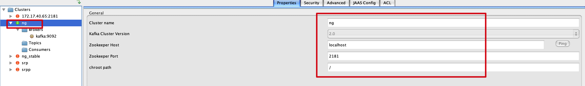

# 官方Java doc

## [KafkaProducer](https://kafka.apache.org/31/javadoc/org/apache/kafka/clients/producer/KafkaProducer.html)


> The producer is *thread safe* and sharing a single producer instance across threads will generally be faster than having multiple instances.

生产者对象是线程安全的，多个线程共享一个生产者对象通常比创建多个生产者对象更快。


使用示例

```java
 Properties props = new Properties();
 props.put("bootstrap.servers", "localhost:9092");
 props.put("acks", "all");
 props.put("retries", 0);
 props.put("linger.ms", 1);
 props.put("key.serializer", "org.apache.kafka.common.serialization.StringSerializer");
 props.put("value.serializer", "org.apache.kafka.common.serialization.StringSerializer");

 Producer<String, String> producer = new KafkaProducer<>(props);
 for (int i = 0; i < 100; i++)
     producer.send(new ProducerRecord<String, String>("my-topic", Integer.toString(i), Integer.toString(i)));

 producer.close();
```

> The producer consists of a pool of buffer space that holds records that haven't yet been transmitted to the server as well as a background I/O thread that is responsible for turning these records into requests and transmitting them to the cluster. Failure to close the producer after use will leak these resources.

生产者拥有一个缓冲空间，用于保存尚未传输到服务器的消息，以及一个后台I/O线程，负责将这些消息转换为请求并将其传输到kafka server。使用后不关闭可能会导致这些资源无法回收。

> The [`send()`](https://kafka.apache.org/31/javadoc/org/apache/kafka/clients/producer/KafkaProducer.html#send(org.apache.kafka.clients.producer.ProducerRecord)) method is asynchronous. When called it adds the record to a buffer of pending record sends and immediately returns. This allows the producer to batch together individual records for efficiency.

`send`方法是异步的。调用时是把待发送的消息写入缓冲池中，并立即返回。批量处理消息时，可以提高性能。

> The `acks` config controls the criteria under which requests are considered complete. The "all" setting we have specified will result in blocking on the full commit of the record, the slowest but most durable setting.

`acks`配置项是一个请求完成的条件。设为`all将会导致阻塞，直到消息被完全提交，最慢，但是最安全。

> If the request fails, the producer can automatically retry, though since we have specified `retries` as 0 it won't. Enabling retries also opens up the possibility of duplicates (see the documentation on [message delivery semantics](http://kafka.apache.org/documentation.html#semantics) for details).

如果请求失败了，生产者会根据`retries`配置项自动重试（如果是`0`不会重试）。启用重试有可能会导致消息的重复。

> The producer maintains buffers of unsent records for each partition. These buffers are of a size specified by the `batch.size` config. Making this larger can result in more batching, but requires more memory (since we will generally have one of these buffers for each active partition).

生产者为每个分区维护未发送记录的缓冲区。这些缓冲区的大小由`batch.size`指定。增大这个配置可能会就会有更多的批量处理，但也需要更多内存（因为我们通常会为每个活动分区提供一个这样的缓冲区）。

> By default a buffer is available to send immediately even if there is additional unused space in the buffer. However if you want to reduce the number of requests you can set `linger.ms` to something greater than 0. This will instruct the producer to wait up to that number of milliseconds before sending a request in hope that more records will arrive to fill up the same batch. This is analogous to Nagle's algorithm in TCP. 

默认情况下，缓冲区内的消息会被立即发送。但是，如果想要减少发送的请求的数量，可以通过将`linger.ms`设置为一个大于0的数来实现。配置了`linger.ms`后，生产者会将这个时间内的消息一起批量发送。这类似于`TCP`中的`Nagle`算法。

> The `buffer.memory` controls the total amount of memory available to the producer for buffering. If records are sent faster than they can be transmitted to the server then this buffer space will be exhausted. When the buffer space is exhausted additional send calls will block. The threshold for time to block is determined by `max.block.ms` after which it throws a TimeoutException.

`buffer.memory`控制了生产者可用于缓冲的内存总量。如果消息的发送速度超过了传输到服务器的速度，那么这个缓冲区空间就会耗尽。当缓冲区空间耗尽时，其他发送调用将被阻止。阻塞时间的阈值由`max.block.ms`确定，超过这个时间会抛出一个`TimeoutException`。


## [KafkaConsumer](https://kafka.apache.org/31/javadoc/org/apache/kafka/clients/consumer/KafkaConsumer.html#)

### 消费者组和Topic订阅 Groups and Topic Subscriptions

> Kafka uses the concept of *consumer groups* to allow a pool of processes to divide the work of consuming and processing records. These processes can either be running on the same machine or they can be distributed over many machines to provide scalability and fault tolerance for processing. All consumer instances sharing the same `group.id` will be part of the same consumer group.

kafka通过定义消费者组的概念，允许多个进程来消费和处理消息。这些进程可以运行在同一个机器，也可以在很多机器（以此做到弹性伸缩和容错）。使用同一个`group.id`的消费者都是这个消费者组的实例。

> Each consumer in a group can dynamically set the list of topics it wants to subscribe to through one of the [`subscribe`](https://kafka.apache.org/31/javadoc/org/apache/kafka/clients/consumer/KafkaConsumer.html#subscribe(java.util.Collection,org.apache.kafka.clients.consumer.ConsumerRebalanceListener)) APIs. Kafka will deliver each message in the subscribed topics to one process in each consumer group. This is achieved by balancing the partitions between all members in the consumer group so that each partition is assigned to exactly one consumer in the group. So if there is a topic with four partitions, and a consumer group with two processes, each process would consume from two partitions.

同一消费者组的每个消费者都可以动态的通过`subscribe` API订阅一些topic。kafka会将topic中的每个消息传送给每个消费者组中的一个消费者。通过平衡分区和组内的消费者，实现每个分区都被分配到一个消费者（一个分区，在同一个消费者组下只对应一个消费者）。因此，如果一个有4个分区的topic，和一个有两个消费者的消费者组，经过平衡后，每个消费者将会消费两个分区。

> Membership in a consumer group is maintained dynamically: if a process fails, the partitions assigned to it will be reassigned to other consumers in the same group. Similarly, if a new consumer joins the group, partitions will be moved from existing consumers to the new one. This is known as *rebalancing* the group and is discussed in more detail [below](https://kafka.apache.org/31/javadoc/org/apache/kafka/clients/consumer/KafkaConsumer.html#failuredetection). Group rebalancing is also used when new partitions are added to one of the subscribed topics or when a new topic matching a [`subscribed regex`](https://kafka.apache.org/31/javadoc/org/apache/kafka/clients/consumer/KafkaConsumer.html#subscribe(java.util.regex.Pattern,org.apache.kafka.clients.consumer.ConsumerRebalanceListener)) is created. The group will automatically detect the new partitions through periodic metadata refreshes and assign them to members of the group.

一个消费者组内的消费关系（消费者和分区的分配关系）是动态维护的：如果一个消费者进程发生了故障，原本分配给它的分区将会被重新分配给组内的消费者。类似地，如果一个新的消费者加入了组，分区也将会从已经存在的消费者上重新分配给新的消费者。这就是组内再平衡。组内再平衡也会发生在添加了新的分区或一个新创建的topic匹配了`subscribed regex`之后。消费者组会通过定期的元数据刷新自动的发现新的分区加入，然后分配给组内的消费者。

> Conceptually you can think of a consumer group as being a single logical subscriber that happens to be made up of multiple processes. As a multi-subscriber system, Kafka naturally supports having any number of consumer groups for a given topic without duplicating data (additional consumers are actually quite cheap).

可以将一个消费者组当作是一个由多个进程组成的单一的逻辑上的订阅者。作为一个支持多个的订阅者的系统，kafka原生的支持一个topic对应有多个消费者组，不需要复制数据。

> In addition, when group reassignment happens automatically, consumers can be notified through a [`ConsumerRebalanceListener`](https://kafka.apache.org/31/javadoc/org/apache/kafka/clients/consumer/ConsumerRebalanceListener.html), which allows them to finish necessary application-level logic such as state cleanup, manual offset commits, etc. See [Storing Offsets Outside Kafka](https://kafka.apache.org/31/javadoc/org/apache/kafka/clients/consumer/KafkaConsumer.html#rebalancecallback) for more details.

另外，当组内重分配自动发生时，消费者可以通过`ConsumerRebalanceListener`监听（可以完成一些应用级别的逻辑，例如状态清理，手动提交等）。

> It is also possible for the consumer to [manually assign](https://kafka.apache.org/31/javadoc/org/apache/kafka/clients/consumer/KafkaConsumer.html#manualassignment) specific partitions (similar to the older "simple" consumer) using [`assign(Collection)`](https://kafka.apache.org/31/javadoc/org/apache/kafka/clients/consumer/KafkaConsumer.html#assign(java.util.Collection)). In this case, dynamic partition assignment and consumer group coordination will be disabled.

当然，也支持通过`assign`来手动地为消费者指定分区消费。在这种情况下，动态的分区分配和组内协调（再平衡）将会关闭。


### 感知消费者故障 Detecting Consumer Failures

> After subscribing to a set of topics, the consumer will automatically join the group when [`poll(Duration)`](https://kafka.apache.org/31/javadoc/org/apache/kafka/clients/consumer/KafkaConsumer.html#poll(java.time.Duration)) is invoked. The poll API is designed to ensure consumer liveness. As long as you continue to call poll, the consumer will stay in the group and continue to receive messages from the partitions it was assigned. Underneath the covers, the consumer sends periodic heartbeats to the server. If the consumer crashes or is unable to send heartbeats for a duration of `session.timeout.ms`, then the consumer will be considered dead and its partitions will be reassigned.

消费者在订阅了topic之后，调用`poll`方法时，会自动的加入到消费者组中。`poll`方法设计被用来确保消费者存活。只要不断的调用`poll`方法，消费者就会保持存活，并继续接收已被分配的分区消息。在后台，消费者也会定时向kafka server发送心跳。如果消费者宕机了，或者没有在`session.timeout.ms`时间间隔内发送心跳，消费者就会被认为停机了，原本分配给该消费者的分区也将会被重新分配。

> It is also possible that the consumer could encounter a "livelock" situation where it is continuing to send heartbeats, but no progress is being made. To prevent the consumer from holding onto its partitions indefinitely in this case, we provide a liveness detection mechanism using the `max.poll.interval.ms` setting. Basically if you don't call poll at least as frequently as the configured max interval, then the client will proactively leave the group so that another consumer can take over its partitions. When this happens, you may see an offset commit failure (as indicated by a [`CommitFailedException`](https://kafka.apache.org/31/javadoc/org/apache/kafka/clients/consumer/CommitFailedException.html) thrown from a call to [`commitSync()`](https://kafka.apache.org/31/javadoc/org/apache/kafka/clients/consumer/KafkaConsumer.html#commitSync())). This is a safety mechanism which guarantees that only active members of the group are able to commit offsets. So to stay in the group, you must continue to call poll.

消费者有可能会发生一种“livelock”的情况，也就是心跳正常，但是却没有在消费。在这种情况下，为了防止消费者无限期的占用其被分配的分区，kafka提供了一种livelock的检测机制，也就是通过设置`max.poll.interval.ms`。一般，如果消费者没有在max.poll.interval.ms时间内调用`poll`，那这个消费者就会主动地离开消费者组（相当于下线），其他的消费者就可以被分配到它所占用的分区。当这种情况发生时，有可能会出现提交失败（如果调用了`commitSync`的话，会有`CommitFailedException`抛出）。这个机制保证了只有消费者组内活跃的消费者才能够提交位点。因此，想要正常的功能，必须持续的调用`poll`方法。

> The consumer provides two configuration settings to control the behavior of the poll loop:
>
> 1. `max.poll.interval.ms`: By increasing the interval between expected polls, you can give the consumer more time to handle a batch of records returned from [`poll(Duration)`](https://kafka.apache.org/31/javadoc/org/apache/kafka/clients/consumer/KafkaConsumer.html#poll(java.time.Duration)). The drawback is that increasing this value may delay a group rebalance since the consumer will only join the rebalance inside the call to poll. You can use this setting to bound the time to finish a rebalance, but you risk slower progress if the consumer cannot actually call [`poll`](https://kafka.apache.org/31/javadoc/org/apache/kafka/clients/consumer/KafkaConsumer.html#poll(java.time.Duration)) often enough.
> 2. `max.poll.records`: Use this setting to limit the total records returned from a single call to poll. This can make it easier to predict the maximum that must be handled within each poll interval. By tuning this value, you may be able to reduce the poll interval, which will reduce the impact of group rebalancing.

消费者有两个配置项可以控制循环`poll`的行为：

1. `max.poll.interval.ms`: 通过增加`poll`的间隔时间，消费者可以有更多的时间处理拉到的消息。缺点就是，增加这个值，可能会使组内再平衡延迟（只会在消费者调用`poll`时进行）。可以通过设置这个值来限制完成一次再平衡的时间，但是如果消费者无法在这个时间调用`poll`，则可能会使进度变慢。
2. `max.poll.records`: 通过设定这个配置项，可以限制一次`poll`调用返回的消息数量。配置了之后，就可以知道每次`poll`时必须处理的消息的最大数量。通过调整这个值，可以减少`poll`间隔，这可以减少组内再平衡的影响。

> For use cases where message processing time varies unpredictably, neither of these options may be sufficient. The recommended way to handle these cases is to move message processing to another thread, which allows the consumer to continue calling [`poll`](https://kafka.apache.org/31/javadoc/org/apache/kafka/clients/consumer/KafkaConsumer.html#poll(java.time.Duration)) while the processor is still working. Some care must be taken to ensure that committed offsets do not get ahead of the actual position. Typically, you must disable automatic commits and manually commit processed offsets for records only after the thread has finished handling them (depending on the delivery semantics you need). Note also that you will need to [`pause`](https://kafka.apache.org/31/javadoc/org/apache/kafka/clients/consumer/KafkaConsumer.html#pause(java.util.Collection)) the partition so that no new records are received from poll until after thread has finished handling those previously returned.

对于消息处理时间变化不可预测的用例，这两个选项都不够。处理这些情况的推荐方法是将消息处理转移到另一个线程，这样消费者就可以继续调用`poll`，确保消费者存活。这种做法就必须小心处理`commit`位点的操作了，要确保已提交的位点不在实际的位点前。还有，必须禁用自动提交，手动提交也只能在处理完这些消息之后。也许可以使用`pause`操作，来暂停从分区获取消息，直到另一个线程把消息处理完成。


### 使用示例 Usage Examples

#### 自动提交 Automatic Offset Committing

```java
     Properties props = new Properties();
     props.setProperty("bootstrap.servers", "localhost:9092");
     props.setProperty("group.id", "test");
     props.setProperty("enable.auto.commit", "true");
     props.setProperty("auto.commit.interval.ms", "1000");
     props.setProperty("key.deserializer", "org.apache.kafka.common.serialization.StringDeserializer");
     props.setProperty("value.deserializer", "org.apache.kafka.common.serialization.StringDeserializer");
     KafkaConsumer<String, String> consumer = new KafkaConsumer<>(props);
     consumer.subscribe(Arrays.asList("foo", "bar"));
     while (true) {
         ConsumerRecords<String, String> records = consumer.poll(Duration.ofMillis(100));
         for (ConsumerRecord<String, String> record : records)
             System.out.printf("offset = %d, key = %s, value = %s%n", record.offset(), record.key(), record.value());
     }
```

设置`enable.auto.commit`为`true`意味着位点的提交将会根据`auto.commit.interval.ms`配置的时间进行，不需要手动提交

#### 手动位点控制 Manual Offset Control

```java
     Properties props = new Properties();
     props.setProperty("bootstrap.servers", "localhost:9092");
     props.setProperty("group.id", "test");
     props.setProperty("enable.auto.commit", "false");
     props.setProperty("key.deserializer", "org.apache.kafka.common.serialization.StringDeserializer");
     props.setProperty("value.deserializer", "org.apache.kafka.common.serialization.StringDeserializer");
     KafkaConsumer<String, String> consumer = new KafkaConsumer<>(props);
     consumer.subscribe(Arrays.asList("foo", "bar"));
     final int minBatchSize = 200;
     List<ConsumerRecord<String, String>> buffer = new ArrayList<>();
     while (true) {
         ConsumerRecords<String, String> records = consumer.poll(Duration.ofMillis(100));
         for (ConsumerRecord<String, String> record : records) {
             buffer.add(record);
         }
         if (buffer.size() >= minBatchSize) {
             insertIntoDb(buffer);
             consumer.commitSync();
             buffer.clear();
         }
     }
```


#### 手动指定分区 Manual Partition Assignment

```java
     String topic = "foo";
     TopicPartition partition0 = new TopicPartition(topic, 0);
     TopicPartition partition1 = new TopicPartition(topic, 1);
     consumer.assign(Arrays.asList(partition0, partition1));
```

> The group that the consumer specifies is still used for committing offsets, but now the set of partitions will only change with another call to [`assign`](https://kafka.apache.org/31/javadoc/org/apache/kafka/clients/consumer/KafkaConsumer.html#assign(java.util.Collection)). Manual partition assignment does not use group coordination, so consumer failures will not cause assigned partitions to be rebalanced. Each consumer acts independently even if it shares a groupId with another consumer. To avoid offset commit conflicts, you should usually ensure that the groupId is unique for each consumer instance.

消费者配置的消费者组依然被用来提交位点，但是其分配的分区只会在`assign`操作会改变。手动指定分区不使用组协调机制（组内再平衡），因此消费者故障不会触发分区重分配。同一消费者组内，每个消费者都是独立的，不会有影响，只是属于同一组。为了避免位点提交冲突，应当确保每个消费者实例的`groupId`都是唯一的。

> Note that it isn't possible to mix manual partition assignment (i.e. using [`assign`](https://kafka.apache.org/31/javadoc/org/apache/kafka/clients/consumer/KafkaConsumer.html#assign(java.util.Collection))) with dynamic partition assignment through topic subscription (i.e. using [`subscribe`](https://kafka.apache.org/31/javadoc/org/apache/kafka/clients/consumer/KafkaConsumer.html#subscribe(java.util.Collection))).

注意：不支持将手动指定分区消费和订阅topic的动态分区分配混合使用。


#### 不使用kafka存储位点 Storing Offsets Outside Kafka

可以不使用kafka来记录提交的位点

例如以下场景

- 如果消费的结果存储在关系数据库中，那么在数据库中存储偏移量也可以允许在单个事务中提交结果和偏移量。因此，要么交易成功，补偿将根据消耗的内容更新，要么结果将不存储，补偿将不更新。

每个消息都有自己的位点，自己实现位点记录只需要做

- 配置`enable.auto.commit=false`
- 从`ConsumerRecord`中获取消息的位点
- 重启时，使用`seek(Topicpartition, long)`来重置位点

#### 控制消费的位点 Controlling The Consumer's Position

> In most use cases the consumer will simply consume records from beginning to end, periodically committing its position (either automatically or manually). However Kafka allows the consumer to manually control its position, moving forward or backwards in a partition at will. This means a consumer can re-consume older records, or skip to the most recent records without actually consuming the intermediate records.

通常情况下，消费者都是把所有的消息从前到后进行消费，定期的提交位点（包括自动和手动提交）。不过kafka也允许消费者手动控制消费的位点，可以向前移动或向后移动消费位点。这也就意味着，消费者可以将老的消息再消费，或者跳过一些没有消费过的消息进行消费。

> Kafka allows specifying the position using [`seek(TopicPartition, long)`](https://kafka.apache.org/31/javadoc/org/apache/kafka/clients/consumer/KafkaConsumer.html#seek(org.apache.kafka.common.TopicPartition,long)) to specify the new position. Special methods for seeking to the earliest and latest offset the server maintains are also available ( [`seekToBeginning(Collection)`](https://kafka.apache.org/31/javadoc/org/apache/kafka/clients/consumer/KafkaConsumer.html#seekToBeginning(java.util.Collection)) and [`seekToEnd(Collection)`](https://kafka.apache.org/31/javadoc/org/apache/kafka/clients/consumer/KafkaConsumer.html#seekToEnd(java.util.Collection)) respectively).

kafka允许通过`seek(TopicPartition, long)`来指定位点。指定消费位点特殊的方法还有移动到最前和最后（`seekToBeginning(Collection)`和`seekToEnd(Collection)`）


#### 消费流量控制 Consumption Flow Control

> If a consumer is assigned multiple partitions to fetch data from, it will try to consume from all of them at the same time, effectively giving these partitions the same priority for consumption. However in some cases consumers may want to first focus on fetching from some subset of the assigned partitions at full speed, and only start fetching other partitions when these partitions have few or no data to consume.

消费者被分配了等多个分区后，就会从所有的这些分区拉取消息，消费时，这些分区的优先级都是一样的。但是在一些情况下，我们也许会希望消费者能够先全力的消费某些分区，只有当这部分分区的没有消息或者消息较少时再去消费其他分区的消息。

> Kafka supports dynamic controlling of consumption flows by using [`pause(Collection)`](https://kafka.apache.org/31/javadoc/org/apache/kafka/clients/consumer/KafkaConsumer.html#pause(java.util.Collection)) and [`resume(Collection)`](https://kafka.apache.org/31/javadoc/org/apache/kafka/clients/consumer/KafkaConsumer.html#resume(java.util.Collection)) to pause the consumption on the specified assigned partitions and resume the consumption on the specified paused partitions respectively in the future [`poll(Duration)`](https://kafka.apache.org/31/javadoc/org/apache/kafka/clients/consumer/KafkaConsumer.html#poll(java.time.Duration)) calls.

kafka支持通过`pasue`和`resume`进行这种动态的消费流量控制


### 读事务消息 Reading Transactional Messages


### 多线程处理 Multi-threaded Processing

> The Kafka consumer is NOT thread-safe. All network I/O happens in the thread of the application making the call. It is the responsibility of the user to ensure that multi-threaded access is properly synchronized. Un-synchronized access will result in [`ConcurrentModificationException`](https://docs.oracle.com/en/java/javase/17/docs/api/java.base/java/util/ConcurrentModificationException.html).

Kafka consumer不是线程安全的。用户应该去报多线程同步访问。非同步访问将会抛出`ConcurrentModificationException`。


## 总结


组内再平衡|组协调

- 只会发生在`subscribe`订阅时，`assign`手动指定分区消费的方式，不会发生再平衡
- 加入/退出消费者，添加新的分区，添加`subscribe regex`的topic后，都会触发
- `max.poll.interval.ms`即`poll`操作的间隔时间会影响组内再平衡
- 一个分区只会分配给一个消费者，一个消费者可能对应多个分区
- 如果消费者没有在`session.timeout.ms`时间内发送心跳或没有进行`poll`操作，会被认为下线，分配给它的分区也将会重新分配给其他的消费者


# 学习


## docker

```
docker-compose -f /Users/lan/IdeaProjects/github/my-learn/kafka/docker/kafka.yml up -d
```


## 工具

[Offset Explorer](https://www.kafkatool.com/download.html)



